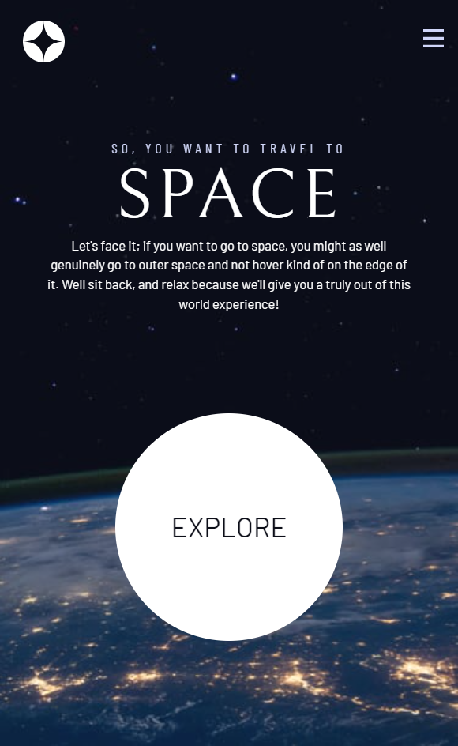

# Frontend Mentor - Space tourism website solution

This is a solution to the [Space tourism website challenge on Frontend Mentor](https://www.frontendmentor.io/challenges/space-tourism-multipage-website-gRWj1URZ3). Frontend Mentor challenges help you improve your coding skills by building realistic projects.

## Table of contents

- [Frontend Mentor - Space tourism website solution](#frontend-mentor---space-tourism-website-solution)
  - [Table of contents](#table-of-contents)
  - [Overview](#overview)
    - [The challenge](#the-challenge)
    - [Screenshot](#screenshot)
    - [Links](#links)
  - [My process](#my-process)
    - [Built with](#built-with)
    - [What I learned](#what-i-learned)
    - [Continued development](#continued-development)
    - [Useful resources](#useful-resources)
  - [Author](#author)
  - [Acknowledgments](#acknowledgments)

## Overview

This challenge was different because it is a partnership between Frontend Mentor, Kevin Powell a YouTuber CSS teacher, and Scrimba a course platform focused on technology and design.
During the course, he encouraged the learnt by proposing small challenges that helps me to have a better understanding of the code.

### The challenge

Users should be able to:

- View the optimal layout for each of the website's pages depending on their device's screen size
- See hover states for all interactive elements on the page
- View each page and be able to toggle between the tabs to see new information

### Screenshot

| Desktop                                           |                      Mobile                      |
| ------------------------------------------------- | :----------------------------------------------: |
|         |         |
|  |  |
|         |         |
|   |   |

### Links

- Solution URL: [Add solution URL here](https://www.frontendmentor.io/solutions/pure-html-css-and-javscript-xzqkd_juO)
- Live Site URL: [Add live site URL here](https://diegoflorenca.github.io/space-travel-scrimba/index.html)

## My process

### Built with

- Semantic HTML5 markup
- CSS custom properties
- Flexbox
- CSS Grid
- Mobile-first workflow

### What I learned

- Use z-index on the parent element to avoid sending the element too far behind
- Keep animations separated from each other give more control to the animation of each element
- Use `em` on media queries for cross-browser compatibility.
- Create `grid-container` → normally done for desktop layouts, create a `grid-template-columns` with `minmax()` making the content width flexible:
  ```css
  grid-template-columns: minmax(2rem, 1fr) repeat...;
  ```
- Difference between `place-content` and `place-itens`.
  `place-content` → Keep the content together and distribute the space around the elements.
  `place-itens` → Distribute the space between the elements.
- Verify browser support before using a css property:

  ```css
  @supports(property:value) { ...

  @supports(backdrop-filter:blur(1rem)) { ...
  ```

- When the element complexity is too high, separete it by a media query.
- Move an element outside of the screen with the `translate` property:
  ```css
  transform: translateX(100%);
  ```
- Scripts using the `defer` attribute will be read after all the HTML.
- Use the `data-` attributes to manipulate elements using JavaScript instead of `classes` and `IDs`. Leaving the style for the `CSS` and the ‘action’ for the JavaScript.
- Use `aria-hidden` for screen readers do not read the element content.

### Continued development

In the future, I want to try to rebuild this project using React.

### Useful resources

- [CSS Grid](https://developer.mozilla.org/en-US/docs/Web/CSS/grid) - A complete description of the placement of grid elements.
- [CSS Flex](https://developer.mozilla.org/en-US/docs/Web/CSS/flex) - Examples that help to understand the main concepts of flexbox.
- [Accessibility](https://developer.mozilla.org/en-US/docs/Web/Accessibility) - Everything you need to know about accessibility.

## Author

- Frontend Mentor - [@diegoflorenca](https://www.frontendmentor.io/profile/diegoflorenca)
- LinkedIn - [@diegoflorenca](https://www.linkedin.com/in/diegoflorenca/)

## Acknowledgments

Kevin Powell is an excellent teacher the [Build a space travel website](https://scrimba.com/learn/spacetravel) course has a lot of important information about accessibility that is essential today.
